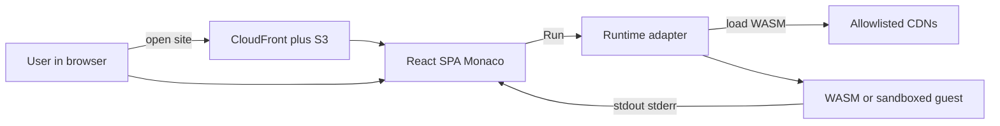

# Playlang

In-browser programming playground. Edit code, hit Run, and see output — all in
your tab. Vazue does not execute or receive your source.

**Live:** [playlang.vazue.com](https://playlang.vazue.com)

## Features

- **13 languages** via WASM and browser engines (JS/TS, Python, Lua, SQL, Ruby,
  PHP, Go, R, C#, Java, C/C++, Elixir)
- **Privacy-first** — no application server runs your code; there is no API that
  accepts playground source
- **Share links** — language and files packed into the URL hash (`#p=…`); anyone
  with the link can open the snapshot (not live collaboration)
- **Static hosting** — production is S3 + CloudFront with a strict CSP

## How it works

Playlang is a static React SPA. There is no backend that stores, compiles, or
executes user code. Runtimes load in the browser from allowlisted CDNs; share
payloads live only in the URL fragment (which browsers do not send to the host).



### Run

1. You edit in [Monaco](https://microsoft.github.io/monaco-editor/)
   (`apps/web`).
2. Run (⌘/Ctrl+Enter) calls `loadRuntime(id)`, which dynamically imports the
   language adapter under `packages/runtimes/`.
3. The adapter downloads its WASM/CDN guest on first use (cold start), then
   executes in an isolated guest:
   - **JavaScript / TypeScript** — sandboxed iframe (`allow-scripts`) via
     MessageChannel
   - **Most other languages** — Web Worker + CDN WASM
   - **Java** — CheerpJ; **C#** — WasmSharp; **Elixir** — Popcorn + a cooked
     AtomVM bundle (`bundle.avm`)
4. Results (`stdout`, `stderr`, timing) render in the UI. Default timeout is
   30s; heavier languages allow longer runs.

### Share

“Copy link” compresses the current language and files with `lz-string` into
`#p=…`. Opening that URL decodes the snapshot client-side. It is a point-in-time
copy, not multiplayer. Links over ~32 KB are refused rather than truncated
(warn at ~8 KB). See `packages/runtime-core/src/share.ts`.

### Production

The site is a static build served from private S3 behind CloudFront. Runtime
binaries come from allowlisted CDNs under CSP / COOP / COEP headers. Deploy and
CSP details live in [`infra/cdk/README.md`](infra/cdk/README.md); privacy and
vulnerability reporting are in [`SECURITY.md`](SECURITY.md).

## Supported languages

| Language | Engine | Notes |
| --- | --- | --- |
| JavaScript | Browser (ES2024) | Sandboxed iframe |
| TypeScript | TypeScript 6.0.3 | Sandboxed iframe |
| Python | Pyodide 314.0.4 | First run ~15–30s |
| Lua | wasmoon 5.4 | |
| SQL | SQLite 3 | In-browser |
| Ruby | ruby.wasm 3.4 | First run ~15–30s |
| PHP | php-wasm 8.4 | First run ~15–30s |
| Go | Yaegi 1.25 | First run ~30–60s |
| R | webR 4.5.1 | First run ~30–60s |
| C# | WasmSharp 14 | First run ~30–90s |
| Java | CheerpJ 17 | First run ~30–90s |
| C / C++ | browsercc 0.1.1 | First run ~60–180s |
| Elixir | Popcorn 0.3.3 | First run ~30–90s; needs `bundle.avm` |

Rust, Swift, and Haskell are omitted — no product-ready in-browser
compile-and-run path yet.

## Repository layout

```text
apps/web/                 React + Vite SPA (Monaco UI, Playwright e2e)
packages/runtime-core/    Language catalog, RuntimeAdapter types, share encode/decode
packages/runtimes/*/      One adapter package per language engine
packages/runtimes/elixir-bundle/   Docker-cooked AtomVM .avm for Elixir
packages/wasi-host/       Shared WASI-ish I/O helpers
infra/cdk/                S3, CloudFront, DNS, ACM, GitHub OIDC, CSP
scripts/                  Elixir cook, CSP sync / smoke helpers
```

## Local development

Requires Node 20+ and [pnpm](https://pnpm.io).

```bash
pnpm install
pnpm cook:elixir   # once if apps/web/public/bundle.avm is missing (needs Docker)
pnpm dev
```

Then open the URL Vite prints (usually `http://localhost:5173`).

```bash
pnpm test:unit
pnpm test:e2e
pnpm test
```

First Playwright run downloads Chromium
(`pnpm --filter @playlang/web exec playwright install chromium`).

CI on GitHub runs typecheck, unit tests, and Playwright tagged `@ci` (JS/TS plus
CSP loader smokes for C# / R / Elixir). Full WASM language e2e is local and must
use production CSP:

```bash
pnpm --filter @playlang/web test:e2e:preview
```

`pnpm test:e2e` against a running `pnpm dev` server does not apply `script-src`
and will not catch CDN / iframe CSP failures.

## Deploy

AWS / CDK is not required to run locally. To deploy to `playlang.vazue.com`, see
[`infra/cdk/README.md`](infra/cdk/README.md). Deploy config belongs in
environment variables, never in git (see `.env.example`).

## Security & privacy

Playlang is a static SPA. User source runs in the browser. Share links put a
compressed snapshot in the **URL hash**, which is not sent to Vazue servers.

Report vulnerabilities privately — see [`SECURITY.md`](SECURITY.md). Do not open
public issues with playground source, AWS keys, or `.env` files.

## License

MIT. Third-party runtimes have their own licenses; see [NOTICE](NOTICE).
